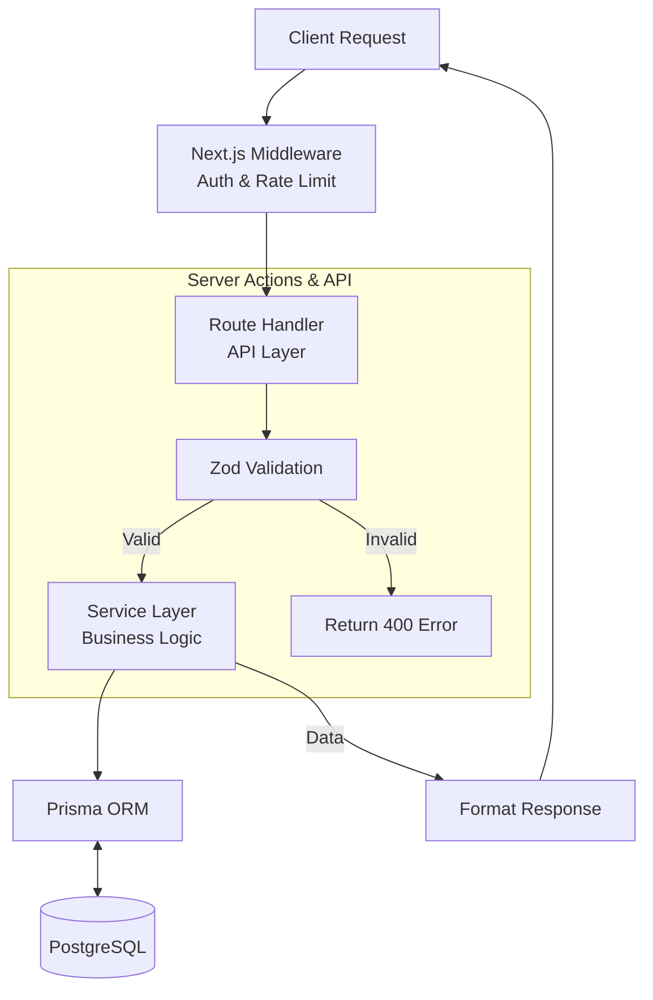

# System Architecture

## 1. System Overview
- **Framework:** Next.js App Router monolith with service-oriented backend
- **Database:** PostgreSQL + Prisma ORM
- **Media Storage:** Cloudinary
- **Payments:** Razorpay
- **Email:** Google SMTP
- **Notifications:** WhatsApp API (optional, feature-flagged)

## 2. Directory Structure
```
src/
├── app/
│   ├── (storefront)/      # Public storefront routes
│   │   ├── layout.tsx
│   │   ├── page.tsx        # Homepage
│   │   ├── shop/page.tsx
│   │   ├── category/[slug]/page.tsx
│   │   ├── product/[slug]/page.tsx
│   │   ├── search/page.tsx
│   │   ├── cart/page.tsx
│   │   ├── checkout/page.tsx
│   │   ├── login/page.tsx
│   │   ├── verify/page.tsx
│   │   ├── account/
│   │   │   ├── layout.tsx
│   │   │   ├── page.tsx        # Redirect to profile
│   │   │   ├── profile/page.tsx
│   │   │   ├── orders/page.tsx
│   │   │   ├── orders/[id]/page.tsx
│   │   │   └── addresses/page.tsx
│   │   ├── about/page.tsx
│   │   ├── contact/page.tsx
│   │   ├── privacy/page.tsx
│   │   ├── terms/page.tsx
│   │   ├── refund-policy/page.tsx
│   │   └── shipping-policy/page.tsx
│   ├── (admin)/
│   │   └── admin/
│   │       ├── layout.tsx
│   │       ├── page.tsx           # Dashboard
│   │       ├── login/page.tsx
│   │       ├── products/
│   │       │   ├── page.tsx       # List
│   │       │   ├── new/page.tsx   # Create
│   │       │   └── [id]/page.tsx  # Edit
│   │       ├── orders/
│   │       │   ├── page.tsx       # List
│   │       │   └── [id]/page.tsx  # Detail
│   │       ├── customers/
│   │       │   ├── page.tsx       # List
│   │       │   └── [id]/page.tsx  # Detail
│   │       ├── coupons/
│   │       │   ├── page.tsx       # List
│   │       │   ├── new/page.tsx   # Create
│   │       │   └── [id]/page.tsx  # Edit
│   │       ├── categories/
│   │       │   ├── page.tsx       # List
│   │       │   ├── new/page.tsx   # Create
│   │       │   └── [id]/page.tsx  # Edit
│   │       └── homepage/
│   │           └── page.tsx       # CMS editor
│   ├── api/
│   │   ├── auth/
│   │   │   ├── send-otp/route.ts
│   │   │   ├── verify-otp/route.ts
│   │   │   ├── logout/route.ts
│   │   │   └── session/route.ts
│   │   ├── products/
│   │   │   ├── route.ts           # GET list
│   │   │   └── [slug]/route.ts    # GET detail
│   │   ├── categories/
│   │   │   ├── route.ts
│   │   │   └── [slug]/route.ts
│   │   ├── search/route.ts
│   │   ├── cart/
│   │   │   ├── route.ts           # GET cart
│   │   │   ├── add/route.ts
│   │   │   ├── update/route.ts
│   │   │   ├── remove/route.ts
│   │   │   └── coupon/route.ts    # POST apply, DELETE remove
│   │   ├── checkout/route.ts
│   │   ├── payment/
│   │   │   ├── create-order/route.ts
│   │   │   ├── verify/route.ts
│   │   │   └── webhook/route.ts
│   │   ├── orders/
│   │   │   ├── route.ts
│   │   │   └── [id]/route.ts
│   │   ├── user/
│   │   │   └── profile/route.ts
│   │   ├── addresses/
│   │   │   ├── route.ts
│   │   │   └── [id]/route.ts
│   │   ├── homepage/route.ts
│   │   └── admin/
│   │       ├── dashboard/route.ts
│   │       ├── products/
│   │       ├── orders/
│   │       ├── customers/
│   │       ├── coupons/
│   │       ├── categories/
│   │       ├── homepage/
│   │       └── media/route.ts
│   ├── layout.tsx                 # Root layout
│   └── globals.css
├── components/
│   ├── ui/          # Button, Input, Select, Modal, Toast, Badge, etc.
│   ├── storefront/  # Header, Footer, ProductCard, Hero, etc.
│   ├── admin/       # AdminSidebar, DataTable, StatusBadge, etc.
│   └── shared/      # PriceDisplay, ImageWithFallback, etc.
├── lib/
│   ├── services/
│   │   ├── auth.service.ts
│   │   ├── product.service.ts
│   │   ├── category.service.ts
│   │   ├── cart.service.ts
│   │   ├── checkout.service.ts
│   │   ├── order.service.ts
│   │   ├── payment.service.ts
│   │   ├── coupon.service.ts
│   │   ├── inventory.service.ts
│   │   ├── email.service.ts
│   │   ├── whatsapp.service.ts
│   │   ├── media.service.ts
│   │   ├── homepage.service.ts
│   │   ├── user.service.ts
│   │   └── address.service.ts
│   ├── db.ts           # Prisma client singleton
│   ├── auth.ts         # Session/cookie utilities
│   ├── cloudinary.ts   # Cloudinary configuration
│   ├── razorpay.ts     # Razorpay client
│   ├── email.ts        # Nodemailer transporter
│   ├── whatsapp.ts     # WhatsApp client
│   ├── rate-limit.ts   # Rate limiting utility
│   ├── validations/    # Zod schemas
│   │   ├── auth.ts
│   │   ├── product.ts
│   │   ├── cart.ts
│   │   ├── checkout.ts
│   │   ├── order.ts
│   │   ├── coupon.ts
│   │   ├── address.ts
│   │   ├── user.ts
│   │   └── admin.ts
│   └── utils.ts
├── hooks/
│   ├── use-cart.ts
│   ├── use-auth.ts
│   └── use-toast.ts
├── types/
│   ├── product.ts
│   ├── order.ts
│   ├── cart.ts
│   ├── user.ts
│   └── admin.ts
└── middleware.ts
```

## 3. Request Flow Architecture



## 4. Server vs Client Component Strategy
- **Server Components:** Utilized for pages, data-fetching layouts, and static content to optimize SEO and reduce client bundle size.
- **Client Components:** Reserved for interactive elements such as cart, filters, modals, forms, and animations.
- **Pattern:** The Server Component fetches necessary data and passes it to the Client Component as props.

## 5. State Management
- **Server state:** Handled via React Server Components and server actions.
- **Client state:** React Context is utilized for global client state like cart and auth status.
- No heavy state libraries like Redux are used.
- Cart is synced with the server on mutations to maintain single source of truth.

## 6. Middleware Architecture
Next.js middleware handles:
- Route protection for `/account/*` and `/admin/*`
- Session validation via HTTP-only cookies
- Admin role check for access to admin panels and APIs
- Rate limiting headers (using standard HTTP headers)

## 7. Error Handling Strategy
- **API routes** return a consistent error format: `{ error: string, code: string, details?: any }`
- **HTTP status codes** employed: 400 (Bad Request), 401 (Unauthorized), 403 (Forbidden), 404 (Not Found), 409 (Conflict), 429 (Too Many Requests), 500 (Internal Server Error)
- **Client-side:** User-facing errors are shown via toast notifications.
- **Server-side:** Structured logging for internal monitoring.
- **Error boundaries** are implemented for robust React component error catching.

## 8. Security Architecture
- **RBAC:** Roles defined as `CUSTOMER` and `ADMIN`. All admin APIs verify role on the server-side.
- **Cookies:** HTTP-only secure cookies used for sessions.
- **Validation:** Zod validation on every input at the API boundary.
- **Rate limiting:** Implemented on auth/OTP endpoints.
- **CSRF protection:** Mitigated via SameSite cookie configurations.
- **Payment Security:** Razorpay signature verification implemented.
- **Secrets:** Environment variables are strictly protected and never exposed to the client unless required (using `NEXT_PUBLIC_` prefix only for public keys).
