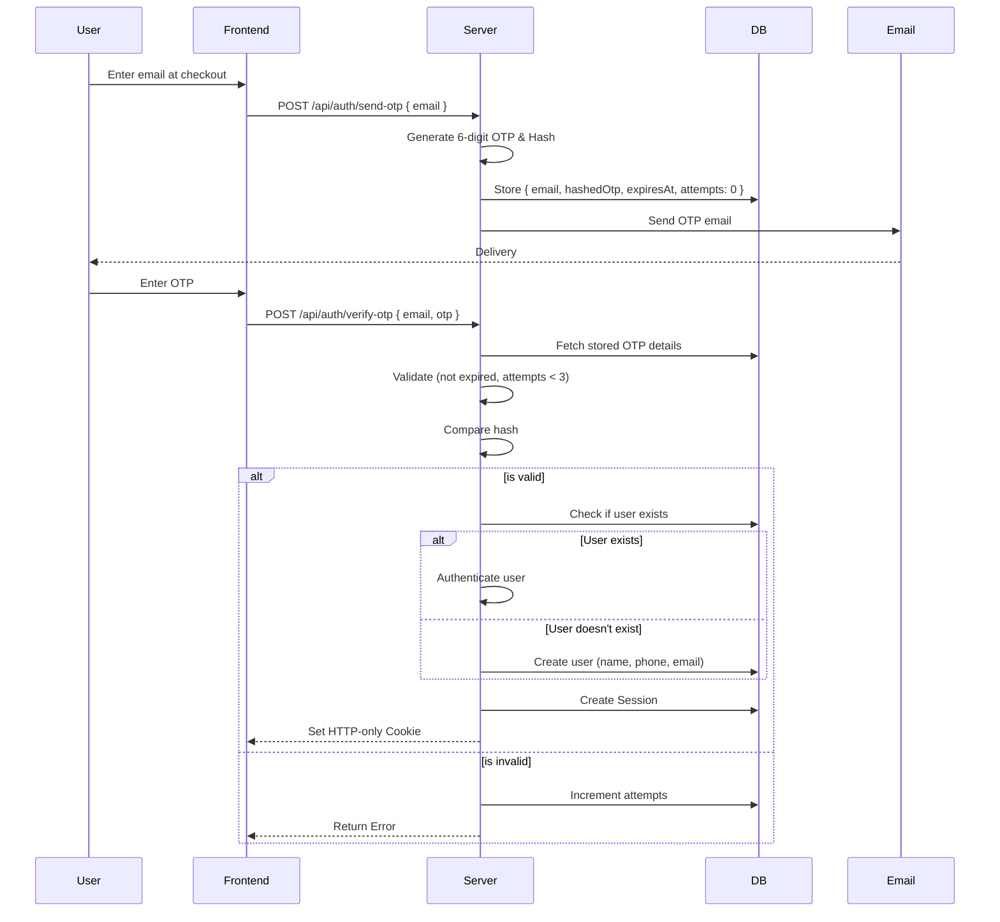
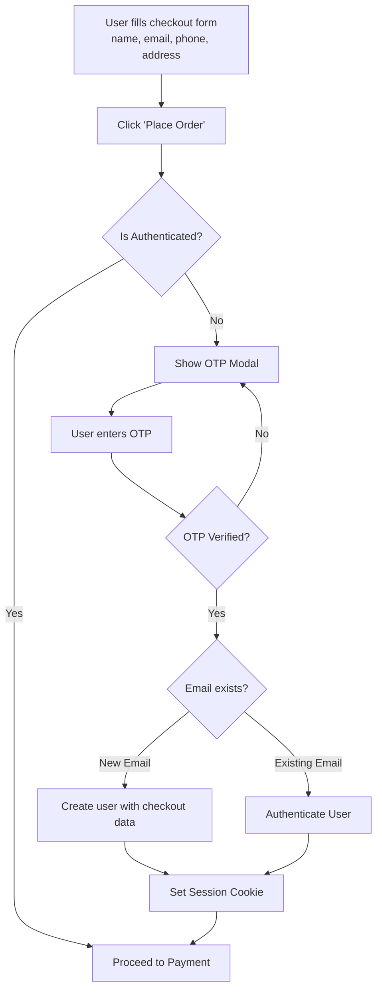

# Authentication Architecture

## 1. Overview
- Passwordless email-based OTP authentication system.
- No passwords stored anywhere in the database.
- Session-based authentication using HTTP-only secure cookies.

## 2. OTP Flow

## 3. OTP Security Rules
- **OTP length:** 6 digits
- **OTP expiry:** 5 minutes
- **Max attempts per OTP:** 3
- **Resend cooldown:** 60 seconds
- **Rate limit:** 5 OTP requests per email per hour
- **IP-based rate limit:** 10 OTP requests per IP per hour
- **Storage:** OTP stored as bcrypt hash (never plaintext)
- **Cleanup:** OTP deleted after successful verification
- **Invalidation:** Previous OTPs invalidated on new request

## 4. Session Management
- **Session ID:** Cryptographically random identifier (e.g., nanoid or crypto.randomUUID).
- **Storage:** Stored in PostgreSQL `Session` table.
- **Session fields:** id, userId, role, expiresAt, createdAt, userAgent, ipAddress.
- **Cookie details:** `ghero_session` (HTTP-only, Secure, SameSite=Lax, Path=/, MaxAge=30 days).
- **Validation:** Conducted on every protected request via middleware.
- **Cleanup:** Expired sessions are periodically purged.

## 5. Role-Based Access Control
- **Roles:** `CUSTOMER`, `ADMIN`
- Role is stored on the `User` model.
- **Middleware checks:**
  - `/account/*` → requires authenticated user (any role)
  - `/admin/*` → requires authenticated user with `ADMIN` role
  - `/api/admin/*` → requires `ADMIN` role (checked server-side in route handler)
  - Public routes → no authentication required

## 6. Checkout Authentication Gate

## 7. Admin Authentication
- Admin login accessible at `/admin/login`.
- Utilizes the same OTP flow with additional checks:
  - Only emails corresponding to an `ADMIN` role can access the admin panel.
  - If a non-admin email attempts admin login, the request is rejected.
  - Admin session inherently has `role=ADMIN`.

## 8. Logout
- **Endpoint:** `POST /api/auth/logout`
- **Actions:**
  - Delete the session record from the database.
  - Clear the `ghero_session` cookie.
  - Redirect the user to the homepage.
