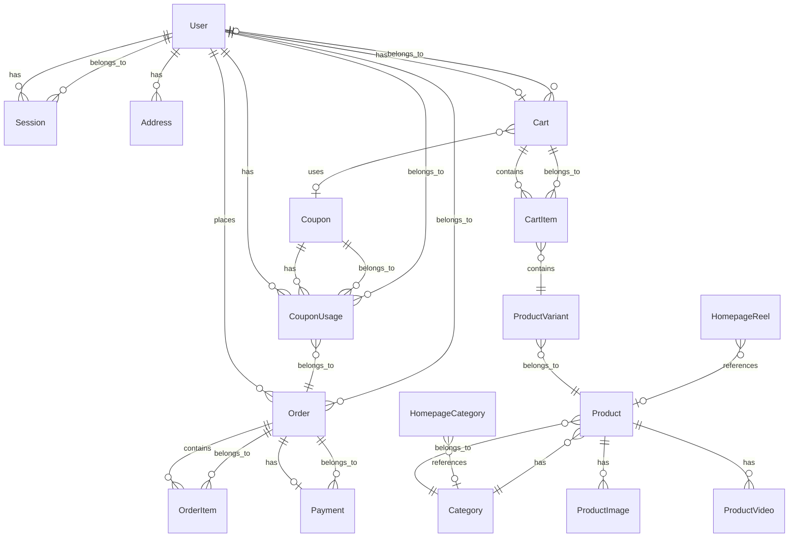

# Database Schema

## Entity Relationship Diagram

## Models Detail

### User
**Fields:**
- `id`: String @id @default(cuid())
- `email`: String @unique
- `name`: String?
- `phone`: String?
- `role`: Role @default(CUSTOMER) // enum: CUSTOMER, ADMIN
- `createdAt`: DateTime @default(now())
- `updatedAt`: DateTime @updatedAt

**Relations:** sessions[], addresses[], orders[], cart?, couponUsages[]
**Indexes:** email (unique)
**Notes:** Core user model for authentication and order association.

### Session
**Fields:**
- `id`: String @id @default(cuid())
- `userId`: String
- `expiresAt`: DateTime
- `userAgent`: String?
- `ipAddress`: String?
- `createdAt`: DateTime @default(now())

**Relations:** user
**Indexes:** userId
**Notes:** Tracks active user sessions.

### OtpVerification
**Fields:**
- `id`: String @id @default(cuid())
- `email`: String
- `hashedOtp`: String
- `expiresAt`: DateTime
- `attempts`: Int @default(0)
- `createdAt`: DateTime @default(now())

**Indexes:** email
**Notes:** Temporary table for storing passwordless OTP auth tokens.

### Address
**Fields:**
- `id`: String @id @default(cuid())
- `userId`: String
- `fullName`: String
- `phone`: String
- `addressLine1`: String
- `addressLine2`: String?
- `area`: String
- `city`: String
- `state`: String
- `pincode`: String
- `country`: String @default("India")
- `isDefault`: Boolean @default(false)
- `createdAt`: DateTime @default(now())
- `updatedAt`: DateTime @updatedAt

**Relations:** user
**Indexes:** userId
**Notes:** User shipping and billing addresses.

### Category
**Fields:**
- `id`: String @id @default(cuid())
- `name`: String
- `slug`: String @unique
- `description`: String?
- `image`: String? // Cloudinary URL
- `cloudinaryId`: String? // Cloudinary public ID
- `displayOrder`: Int @default(0)
- `isVisible`: Boolean @default(true)
- `createdAt`: DateTime @default(now())
- `updatedAt`: DateTime @updatedAt

**Relations:** products[]
**Indexes:** slug (unique)
**Notes:** Product categories.

### Product
**Fields:**
- `id`: String @id @default(cuid())
- `name`: String
- `slug`: String @unique
- `description`: String? @db.Text
- `fabric`: String?
- `careInstructions`: String? @db.Text
- `sizeGuide`: String? @db.Text
- `categoryId`: String
- `basePrice`: Decimal @db.Decimal(10, 2)
- `baseMrp`: Decimal @db.Decimal(10, 2)
- `isBestseller`: Boolean @default(false)
- `isNewArrival`: Boolean @default(false)
- `isPublished`: Boolean @default(false)
- `createdAt`: DateTime @default(now())
- `updatedAt`: DateTime @updatedAt

**Relations:** category, variants[], images[], videos[]
**Indexes:** slug (unique), categoryId, isPublished, isBestseller, isNewArrival, createdAt
**Notes:** Central product definition holding common properties across variants.

### ProductVariant
**Fields:**
- `id`: String @id @default(cuid())
- `productId`: String
- `sku`: String @unique
- `size`: String?
- `color`: String?
- `colorHex`: String?
- `price`: Decimal @db.Decimal(10, 2)
- `mrp`: Decimal @db.Decimal(10, 2)
- `stock`: Int @default(0)
- `isAvailable`: Boolean @default(true)
- `createdAt`: DateTime @default(now())
- `updatedAt`: DateTime @updatedAt

**Relations:** product
**Indexes:** productId, sku (unique), isAvailable
**Notes:** Defines specific SKUs (size/color combinations) for a product.

### ProductImage
**Fields:**
- `id`: String @id @default(cuid())
- `productId`: String
- `url`: String
- `cloudinaryId`: String
- `alt`: String?
- `displayOrder`: Int @default(0)
- `createdAt`: DateTime @default(now())

**Relations:** product
**Indexes:** productId

### ProductVideo
**Fields:**
- `id`: String @id @default(cuid())
- `productId`: String
- `url`: String
- `cloudinaryId`: String
- `thumbnail`: String?
- `displayOrder`: Int @default(0)
- `createdAt`: DateTime @default(now())

**Relations:** product
**Indexes:** productId

### Cart
**Fields:**
- `id`: String @id @default(cuid())
- `userId`: String? @unique // null for guest carts
- `sessionId`: String? @unique // for guest identification
- `couponId`: String?
- `createdAt`: DateTime @default(now())
- `updatedAt`: DateTime @updatedAt

**Relations:** user?, coupon?, items[]
**Indexes:** userId, sessionId

### CartItem
**Fields:**
- `id`: String @id @default(cuid())
- `cartId`: String
- `variantId`: String
- `quantity`: Int @default(1)
- `createdAt`: DateTime @default(now())
- `updatedAt`: DateTime @updatedAt

**Relations:** cart, variant
**Indexes:** cartId, variantId
**Unique Constraints:** [cartId, variantId]
**Notes:** Items within a shopping cart.

### Order
**Fields:**
- `id`: String @id @default(cuid())
- `orderNumber`: String @unique
- `userId`: String
- `status`: OrderStatus @default(PENDING_PAYMENT)
- `subtotal`: Decimal @db.Decimal(10, 2)
- `discount`: Decimal @db.Decimal(10, 2) @default(0)
- `couponCode`: String?
- `couponDiscount`: Decimal @db.Decimal(10, 2) @default(0)
- `total`: Decimal @db.Decimal(10, 2)
- `shippingName`: String
- `shippingPhone`: String
- `shippingEmail`: String
- `shippingAddress1`: String
- `shippingAddress2`: String?
- `shippingArea`: String
- `shippingCity`: String
- `shippingState`: String
- `shippingPincode`: String
- `shippingCountry`: String @default("India")
- `trackingUrl`: String?
- `notes`: String?
- `createdAt`: DateTime @default(now())
- `updatedAt`: DateTime @updatedAt

**Relations:** user, items[], payment?
**Indexes:** userId, orderNumber, status, createdAt
**Notes:** OrderStatus enum: PENDING_PAYMENT, PAID, PROCESSING, SHIPPED, DELIVERED, CANCELLED

### OrderItem
**Fields:**
- `id`: String @id @default(cuid())
- `orderId`: String
- `productName`: String // Snapshot
- `productSlug`: String // Snapshot
- `sku`: String // Snapshot
- `size`: String? // Snapshot
- `color`: String? // Snapshot
- `quantity`: Int
- `unitPrice`: Decimal @db.Decimal(10, 2)
- `unitMrp`: Decimal @db.Decimal(10, 2)
- `imageUrl`: String? // Snapshot of first product image
- `createdAt`: DateTime @default(now())

**Relations:** order
**Indexes:** orderId
**Notes:** Stores snapshot data at the time of purchase.

### Payment
**Fields:**
- `id`: String @id @default(cuid())
- `orderId`: String @unique
- `razorpayOrderId`: String @unique
- `razorpayPaymentId`: String? @unique
- `razorpaySignature`: String?
- `amount`: Decimal @db.Decimal(10, 2)
- `currency`: String @default("INR")
- `status`: PaymentStatus @default(PENDING)
- `createdAt`: DateTime @default(now())
- `updatedAt`: DateTime @updatedAt

**Relations:** order
**Indexes:** orderId, razorpayOrderId
**Notes:** PaymentStatus enum: PENDING, CAPTURED, FAILED, REFUNDED

### Coupon
**Fields:**
- `id`: String @id @default(cuid())
- `code`: String @unique
- `type`: CouponType // PERCENTAGE, FLAT
- `applyOn`: ApplyOn // CART_VALUE, MRP
- `discountValue`: Decimal @db.Decimal(10, 2)
- `maxDiscount`: Decimal? @db.Decimal(10, 2) // For percentage coupons
- `minCartValue`: Decimal? @db.Decimal(10, 2)
- `maxUsage`: Int?
- `perUserLimit`: Int? @default(1)
- `isActive`: Boolean @default(true)
- `startsAt`: DateTime?
- `expiresAt`: DateTime?
- `createdAt`: DateTime @default(now())
- `updatedAt`: DateTime @updatedAt

**Relations:** usages[]
**Indexes:** code
**Notes:** CouponType enum: PERCENTAGE, FLAT. ApplyOn enum: CART_VALUE, MRP

### CouponUsage
**Fields:**
- `id`: String @id @default(cuid())
- `couponId`: String
- `userId`: String
- `orderId`: String
- `createdAt`: DateTime @default(now())

**Relations:** coupon, user
**Indexes:** couponId, userId
**Unique Constraints:** [couponId, userId, orderId]

### HomepageHero
**Fields:**
- `id`: String @id @default(cuid())
- `imageUrl`: String
- `imageCloudinaryId`: String
- `mobileImageUrl`: String?
- `mobileCloudinaryId`: String?
- `heading`: String
- `subheading`: String?
- `ctaText`: String?
- `ctaUrl`: String?
- `secondaryCta`: String?
- `secondaryCtaUrl`: String?
- `isVisible`: Boolean @default(true)
- `displayOrder`: Int @default(0)
- `createdAt`: DateTime @default(now())
- `updatedAt`: DateTime @updatedAt

### HomepageCategory
**Fields:**
- `id`: String @id @default(cuid())
- `categoryId`: String?
- `name`: String
- `imageUrl`: String
- `cloudinaryId`: String
- `link`: String
- `displayOrder`: Int @default(0)
- `isVisible`: Boolean @default(true)
- `createdAt`: DateTime @default(now())
- `updatedAt`: DateTime @updatedAt

**Relations:** category?

### HomepageReel
**Fields:**
- `id`: String @id @default(cuid())
- `mediaUrl`: String
- `cloudinaryId`: String
- `mediaType`: String // 'image' or 'video'
- `thumbnail`: String?
- `caption`: String?
- `productId`: String?
- `link`: String?
- `displayOrder`: Int @default(0)
- `isVisible`: Boolean @default(true)
- `createdAt`: DateTime @default(now())
- `updatedAt`: DateTime @updatedAt

**Relations:** product?

### Testimonial
**Fields:**
- `id`: String @id @default(cuid())
- `customerName`: String
- `review`: String @db.Text
- `rating`: Int @default(5)
- `imageUrl`: String?
- `cloudinaryId`: String?
- `productName`: String?
- `isVisible`: Boolean @default(true)
- `displayOrder`: Int @default(0)
- `createdAt`: DateTime @default(now())
- `updatedAt`: DateTime @updatedAt

### EmailEvent
**Fields:**
- `id`: String @id @default(cuid())
- `eventType`: String // OTP, ORDER_CONFIRMATION, SHIPPED, DELIVERED
- `recipient`: String
- `orderId`: String?
- `status`: String @default("SENT") // SENT, FAILED
- `metadata`: Json? // Any additional data
- `createdAt`: DateTime @default(now())

**Indexes:** eventType, recipient, orderId
**Unique Constraints:** [eventType, orderId]
**Notes:** Tracks sent emails, prevents duplicates per order.

### WhatsAppEvent
**Fields:**
- `id`: String @id @default(cuid())
- `eventType`: String // OTP, ORDER_CONFIRMATION, SHIPPED, DELIVERED
- `recipient`: String
- `orderId`: String?
- `status`: String @default("SENT")
- `metadata`: Json?
- `createdAt`: DateTime @default(now())

**Indexes:** eventType, recipient, orderId
**Unique Constraints:** [eventType, orderId]
**Notes:** Tracks sent WhatsApp messages.
