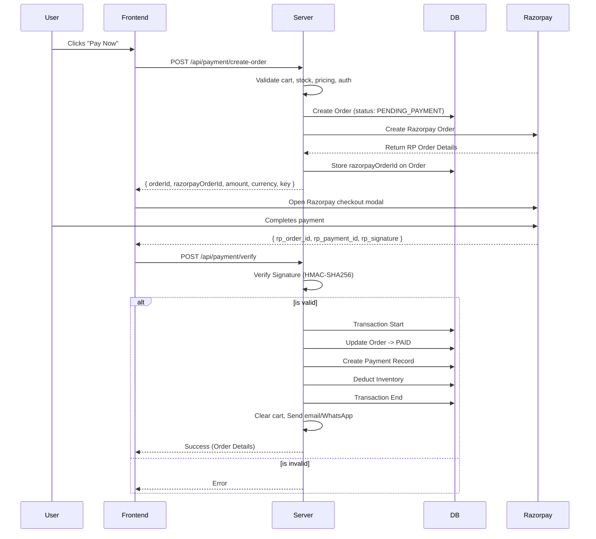

# Payment Architecture

## 1. Overview
- Online payment only (NO Cash On Delivery).
- **Payment Gateway:** Razorpay.
- Server-side order creation and verification to ensure data integrity.
- Webhooks utilized for reliability and background processing.

## 2. Payment Flow

## 3. Webhook Handling
- **Endpoint:** `POST /api/payment/webhook`
- **Verification:** Verify webhook signature using `HMAC-SHA256(request body, webhook_secret)`.
- **Events handled:** `payment.captured`, `payment.failed`.
- **Idempotency:** 
  - Ensure order is not processed multiple times.
  - Use `razorpayOrderId` as the idempotency key.
  - If the order is already marked as `PAID`, skip processing.

## 4. Inventory Strategy
- **NO reservation** at cart/checkout time to keep the architecture simple.
- Stock is validated at the moment of payment creation.
- Stock is deducted **transactionally** ONLY after payment verification.
- If stock is insufficient at verification: refund the payment and cancel the order.
- **Implementation:** Utilize Prisma transaction (`prisma.$transaction()`) for atomic stock deduction and order update.

## 5. Failure Scenarios
- **Payment fails:** Order stays `PENDING_PAYMENT`, allowing the user to retry.
- **Payment cancelled:** Handled exactly like a failure.
- **Browser disconnects after payment:** The Webhook will securely catch the event and process the order.
- **Duplicate webhook:** Idempotency checks prevent double processing.
- **Amount mismatch:** Payment is rejected and logged for internal investigation.
- **Razorpay timeout:** Order expires after 30 minutes via background cleanup mechanisms.

## 6. Order Expiry
- Orders stuck in `PENDING_PAYMENT` for > 30 minutes are automatically cancelled.
- Cancellation mechanism can be a cron job or checked lazily upon next access.
- Cancelled orders release no inventory, as stock was never deducted.

## 7. Refunds
- Automated refunds are not supported in v1.
- Administrators can process refunds directly through the Razorpay dashboard.
- Future enhancement: API-based refund processing from the admin panel.

## 8. Security Checklist
- [x] Server-side order creation
- [x] Server-side amount calculation (never trust frontend input)
- [x] Razorpay signature verification
- [x] Webhook signature verification
- [x] Idempotent payment processing
- [x] Transactional inventory deduction
- [x] Amount mismatch detection
- [x] HTTPS only for all endpoints
- [x] Razorpay keys strictly stored in server environment variables
